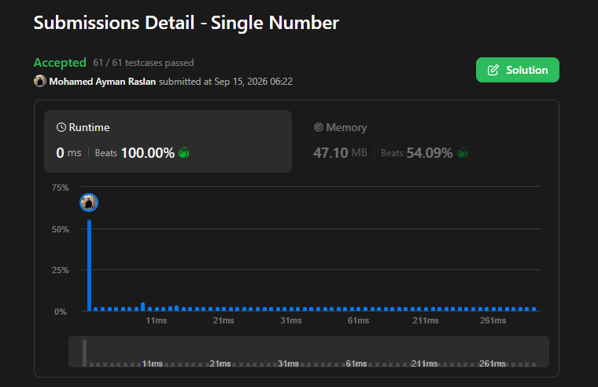

**LeetCode Profile:** [Mohamed Ayman Raslan](https://leetcode.com/u/moh7amed_ayman25/)

## LeetCode Challenge

| # | Problem | Problem Link | Solution / Submission |
|---|---|---|---|
| 1 | Two Sum | [View Problem](https://leetcode.com/problems/two-sum/) | [View Submission](https://leetcode.com/submissions/detail/2135558506/) |
| 2 | Reverse String | [View Problem](https://leetcode.com/problems/reverse-string/) | [View Submission](https://leetcode.com/submissions/detail/2140013458/) |
| 3 | Single Number | [View Problem](https://leetcode.com/problems/single-number/) | [View Submission](https://leetcode.com/submissions/detail/2142131466/) |
| 4 | Single Number | [View Problem](https://leetcode.com/problems/greatest-common-divisor-of-strings/) | [View Submission](https://leetcode.com/problems/greatest-common-divisor-of-strings/submissions/2153401003/) |
| 5 | Single Number | [View Problem](https://leetcode.com/problems/valid-anagram/) | [View Submission](https://leetcode.com/problems/valid-anagram/submissions/2153401457/) |

## Accepted Submission

